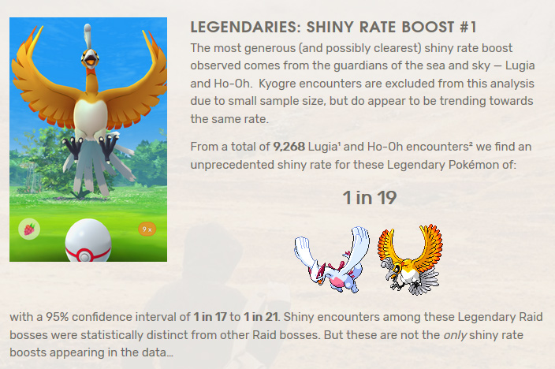
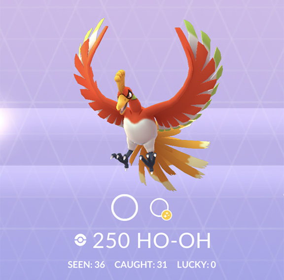
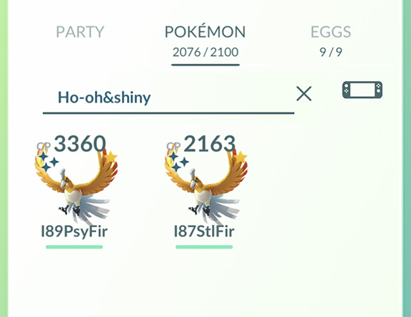
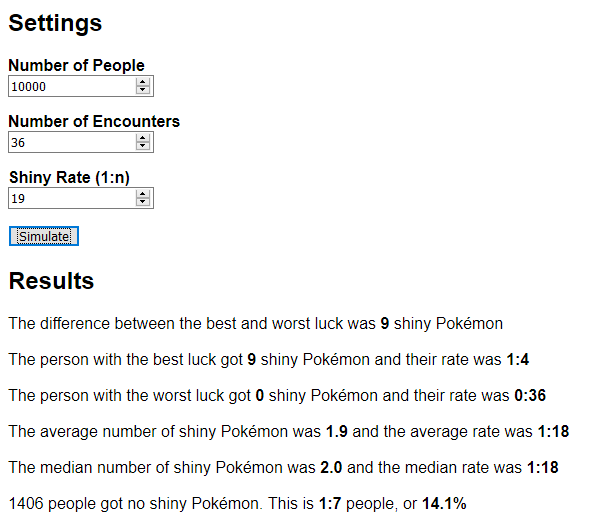
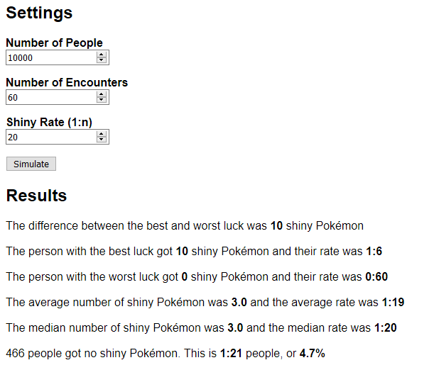

# pokemon-go-shiny-simulator

[Try it here](http://nrkn.com/pokemon-go-shiny-simulator/)

There is a lot of discussion about whether or not the random numbers that
determine if you get a shiny in Pokémon Go are fair, or if some accounts are
actually biased in a way that means that they get more shinies than others.
If you just compare yourself to your friends, it certainly seems like some
people get more than their share of luck!

The actual mechanics of Pokémon Go are unknown, but this simulation uses
fair random numbers, like rolling a dice, with no bias towards any
particular virtual "account" within the simulation.

The simulation shows that even with fair random numbers, there is more than
enough variance to explain why some of your friends' accounts seem to be
biased.

After building this and playing with it for a while, I believe that
rather than some of the theories about the random number generator being
seeded by your account ID or similar, it really is just luck.

The feeling that some people have "biased" accounts is caused by the small
sample size of how many people you personally know, and the relatively small
(typically tens of thousands) number of encounters any one player can have
had over the lifetime of the game so far.

## settings

The settings for the simulation are as follows, the defaults I've picked are
really just rough guesses.

### Number of People

Choose a number between `2` and `100,000`

I picked a default of `10` to reflect a reasonable number of people you may
know and talk to about your number of shinies

### Number of Encounters

Choose a number between `10` and `250,000`

I picked a default of `50,000` as myself and a couple of other friends have
caught around `40,000` Pokémon each and I estimate based on seen/caught counts
for a few Pokémon that I've shiny checked maybe an additional `10,000` without
actually trying to catch them

### Shiny rate

Choose a number between `10` and `450`

I picked an overall default of `400` as it seems like the rate for most Pokémon
is **1:450**, but your odds are actually a bit better due to better chances for
community day Pokémon, special events etc.

## Some things to try

### Compare for a specific Pokémon

See how good your luck has been!

- Try to find out what the shiny rate is believed to be. Check
  [Silph Road](https://thesilphroad.com/science/pokemon-go-shiny-raid-bosses-community-day-rate/)
  or use Google. If you can't find anything, it's probaby **1:450**
- Check your dex and see how many you've seen
- Check your storage and see how many shinies you have
- Use a larger number of people than the default, try `10,000` or even `100,000`

#### Example

Ho-oh is roughly 1:19:

You've seen 36:

You've caught 2:

Enter a large number of people, then put in your values and click simulate:

In this case, you were neither particularly lucky nor unlucky - the
average/median are both around 2, which is how many you had

### Compare for a specific event

During the Latias raid week, I did around 60 raids and didn't get a single
shiny!

Let's see how that compares to the simulation, assuming Latias was around 1:20
during the event:

Ouch! My luck was particularly bad. Only 4.7% of people got no shiny.

## license

MIT License

Copyright (c) 2019 Nik Coughlin

Permission is hereby granted, free of charge, to any person obtaining a copy
of this software and associated documentation files (the "Software"), to deal
in the Software without restriction, including without limitation the rights
to use, copy, modify, merge, publish, distribute, sublicense, and/or sell
copies of the Software, and to permit persons to whom the Software is
furnished to do so, subject to the following conditions:

The above copyright notice and this permission notice shall be included in all
copies or substantial portions of the Software.

THE SOFTWARE IS PROVIDED "AS IS", WITHOUT WARRANTY OF ANY KIND, EXPRESS OR
IMPLIED, INCLUDING BUT NOT LIMITED TO THE WARRANTIES OF MERCHANTABILITY,
FITNESS FOR A PARTICULAR PURPOSE AND NONINFRINGEMENT. IN NO EVENT SHALL THE
AUTHORS OR COPYRIGHT HOLDERS BE LIABLE FOR ANY CLAIM, DAMAGES OR OTHER
LIABILITY, WHETHER IN AN ACTION OF CONTRACT, TORT OR OTHERWISE, ARISING FROM,
OUT OF OR IN CONNECTION WITH THE SOFTWARE OR THE USE OR OTHER DEALINGS IN THE
SOFTWARE.
